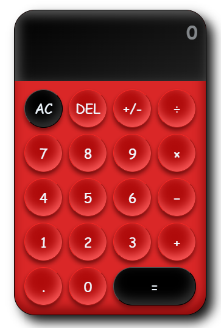

# calculator
 Creating a strong calculator app with pure JavaScript, this project demonstrates expertise in fundamental web technologies. 
 It excels in math functions, user-friendly design, and adaptability across different devices, ensuring a smooth user experience.
 Using plain JavaScript emphasizes efficient code and high performance.

 ## Visual-result: https://codepen.io/GUETIX/pen/mdvOogO

